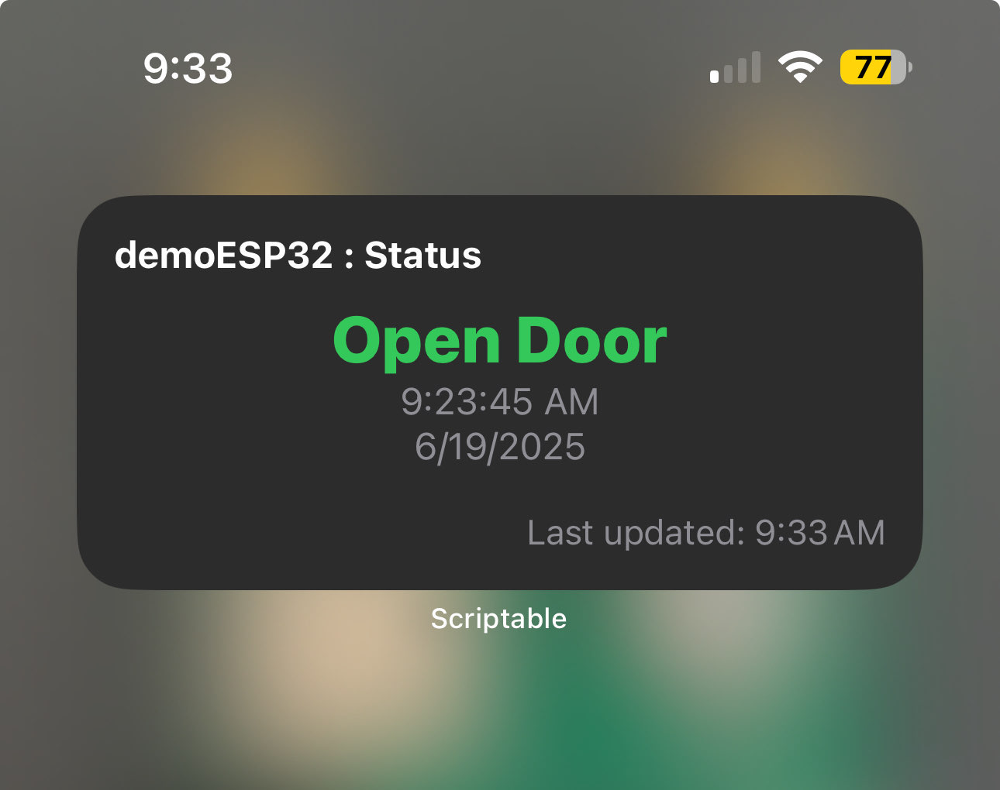

# Dweet.me Scriptable iPhone Home Screen Widget
Shows status of the latest dweet as a widget on a phone using the [Scriptable app](https://scriptable.app/).

Ready-built way to add widgets to iOS that fetch and display a content key value from a dweet.me topic feed.
It uses the Scriptable app to place a scriptable widget on the Home or Lock Screen.

Some cool features:
- **Multiple Home Screen widgets** to monitor different Dweet topics and/or key values by changing the Parameter values in the Home Screen (see instructions below)!
- Works with the iPhone's Light Mode and Dark Mode.
- JavaScript open source so you can modify as you see fit and even modified outside the app (browser, Android, Chromebook, etc.).

# Instructions
1. Copy this entire script.
2. Open the Scriptable app on your iOS device.
3. Tap the '+' icon to create a new script.
4. Paste this code into the new script.
5. Tap the 'Run' button (▶) to test it. Note no parameters added, so coded default parameters will probably show an error.

## To add it to your **Home Screen** (as of iOS 18):
1. Go to Home Screen and add Scriptable widget, then tap Done.
2. Long tap on widget & select 'Edit Widget'
3. Set 'Script' to 'DweetStatus'.
4. Set 'When Interacting' to 'Run Script'.
5. Set Parameter to your `<Dweet topic>, <content key>` or leave blank & set below here in app.

## To add it to your **Lock Screen** (as of iOS 18):
1. Go to 'Customize' Lock Screen (tap and hold on Lock Screen & tap 'Customize').
2. Select the Lock Screen you want to customize.
3. Tap on widget area to bring up 'Add Widgets'.
4. Scroll down to Scriptable, select, & tap or drag to add widget.
5. Tap the placed Scriptable widget.
6. Set 'Script' to 'DweetStatus'.
7. Set 'When Interacting' to 'Run Script'.
8. Set Parameter to your `<Dweet topic>, <content key>` or leave blank & set below here in app.

## Example
Dweet was posted with: `curl 'http://dweet.me:3333/publish/yoink/for/rotaryswitch8374?position=2'`

Set widget Parameter value to `rotaryswitch8374, position`.

# Next Steps
Use this as a beginning base. Feel free to change it and adapt it to your needs!
- change the colors for both Light and Dark Modes,
- add the ability to respond/send a Dweet.
